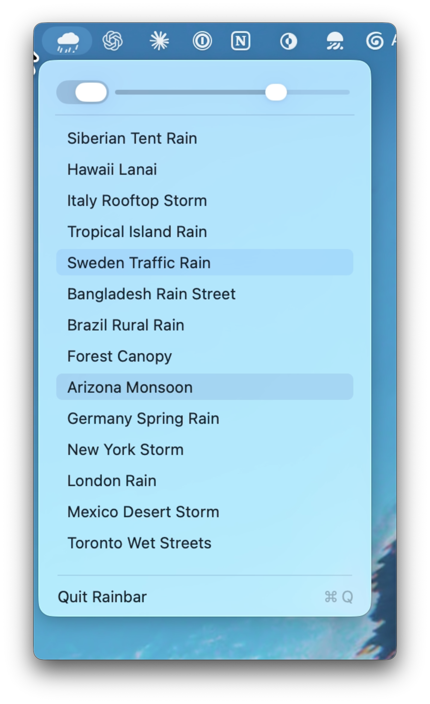

<p align="center">
  
</p>

<h1 align="center">Rainbar</h1>

<p align="center">
  A tiny macOS menu bar app for long, natural rain ambience.<br>
  Pick a place, set the volume, and let it loop without the white-noise machine feel.
</p>

<p align="center">
  <a href="https://github.com/grinich/rainbar/releases/latest/download/Rainbar.app.zip">
    
  </a>
</p>

<p align="center">
  
</p>

## Highlights

- Native menu bar app with no Dock icon.
- Left-click or right-click the cloud icon to open the normal macOS dropdown.
- Native on/off switch and volume slider.
- A curated set of long rain tracks from different regions and cities.
- Track selection starts playback when Rainbar is off.
- Randomized start position, so the same track does not always begin the same way.
- Crossfaded looping to avoid a dead pause when a track repeats.
- Per-track playback gain normalization, so switching tracks does not swing wildly in volume.
- Built-in GitHub Releases updates with automatic relaunch.
- Open at Login support from the Rainbar menu.
- Remembers the selected rain track and volume level between launches.
- No accounts, analytics, telemetry, or background services after launch.

## Rain Tracks

Rainbar bundles CC0/public-domain rain audio from Freesound and Rain Sounds for Sleeping:

| Track | Source vibe |
| --- | --- |
| Siberian Tent Rain | Rain on a tent roof in the Altay Mountains |
| Hawaii Lanai | Big Island rain with coqui frogs and gutter runoff |
| Italy Rooftop Storm | Distant thunder from Jesolo, Italy |
| Tropical Island Rain | Heavy tropical rain on a concrete terrace |
| Sweden Traffic Rain | Urban rain, traffic, and thunder from Stockholm |
| Bangladesh Rain Street | Light urban rain and mosque calls from Khulna |
| Mumbai Rain | Night rain striking a balcony shade in Mumbai |
| Brazil Rural Rain | Heavy rural rain |
| Forest Canopy | Forest rain hitting understory leaves |
| Arizona Monsoon | Long desert monsoon rain |
| Germany Spring Rain | Gentle city spring rain |
| New York Storm | Manhattan rain and thunder |
| London Rain | Long South London urban rain |
| Mexico Desert Storm | Desert thunderstorm from Sonora |
| Toronto Wet Streets | Rainy city streets with distant thunder |

Full attribution and source URLs live in [Resources/AudioCredits.txt](Resources/AudioCredits.txt).

## Development

The app is intentionally small:

```text
Sources/Rainbar/main.m      AppKit UI, menu bar icon drawing, audio playback
Resources/Audio/            Bundled CC0 rain tracks
Resources/AudioCredits.txt  Source and license notes for bundled audio
Scripts/build_app.sh        Local app bundle build script
```

Build from source:

```sh
Scripts/build_app.sh
```

The build writes `build/Rainbar.app`. It uses only Apple system frameworks: AppKit and AVFoundation.

## Audio Behavior

Rainbar streams bundled MP3 files through `AVAudioEngine`. Each track starts from a random point in the first 30 seconds, then the app schedules a second player node near the end and crossfades into the next loop. Track changes also crossfade.

The user-facing volume slider is mapped to a perceptual-ish gain curve, and each track has a measured playback gain adjustment so quieter recordings, such as Arizona Monsoon, sit closer to the rest of the library.

## Updates

Rainbar checks GitHub Releases once a day after launch. If a newer release is available, it downloads `Rainbar.app.zip`, replaces the current app bundle, quits, and relaunches.

You can also check manually from the Rainbar menu.

## Privacy

Rainbar is local-only:

- No analytics.
- No telemetry.
- No account system.
- No cloud sync.
- No network requests except GitHub release checks and update downloads.

The only bundled media is the audio shipped inside the app bundle.

## License

Rainbar is available under the [MIT License](LICENSE).

Bundled rain recordings are CC0/public-domain or CC0-derived preview files. See [Resources/AudioCredits.txt](Resources/AudioCredits.txt) for per-track credits and source links.
